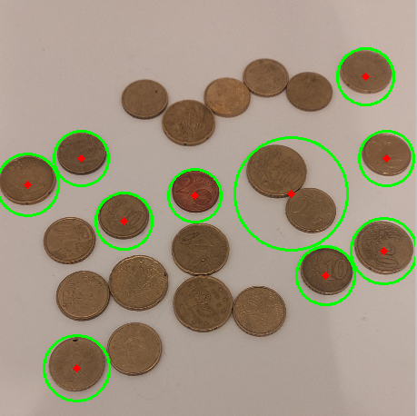
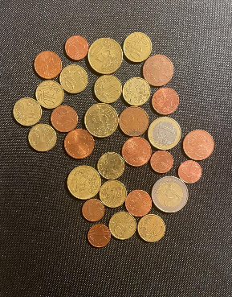
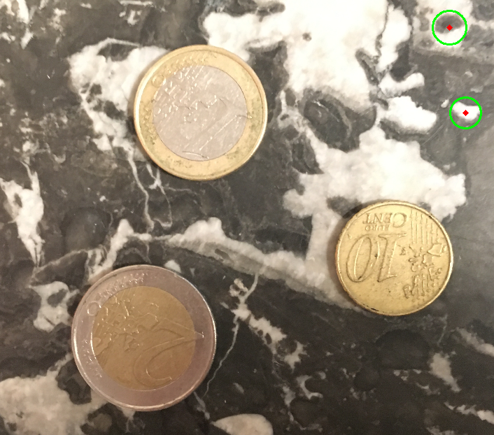
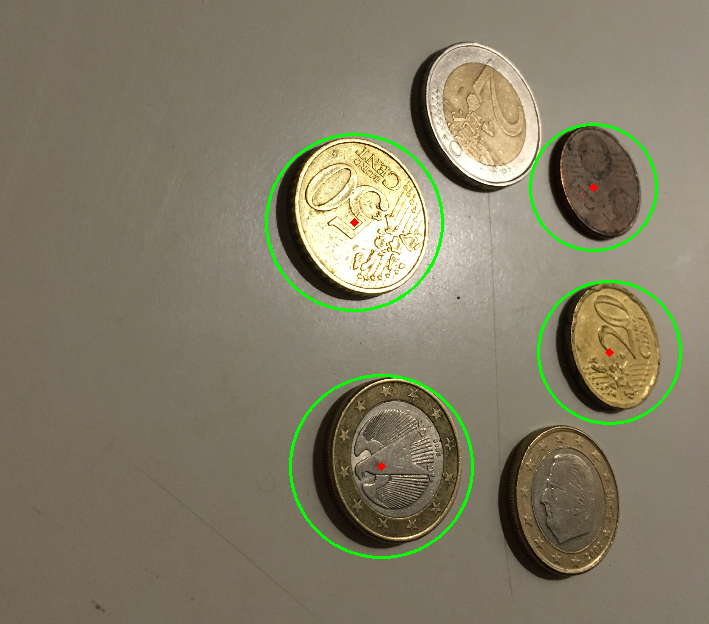
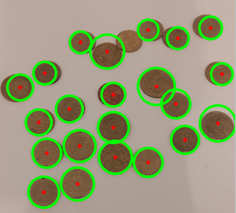
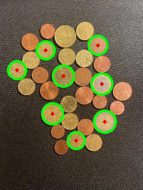
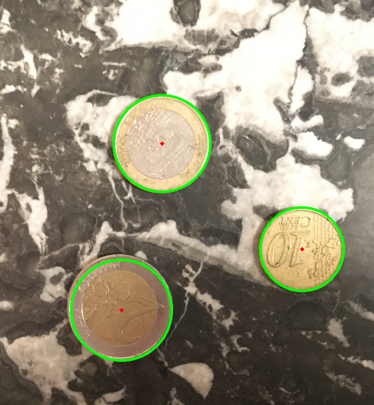
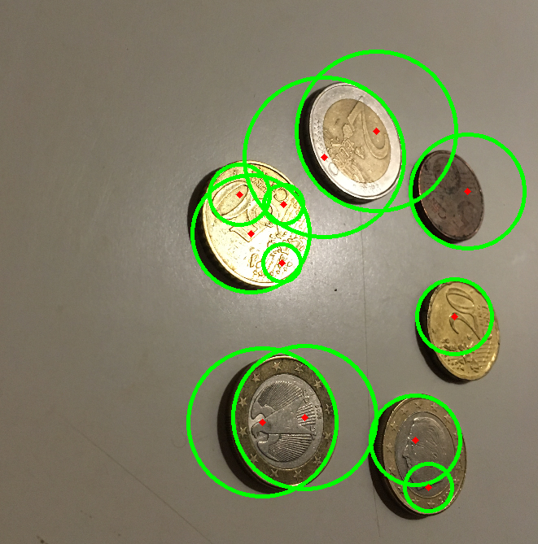

# Presentation
Ce projet vise à développer un système de comptage de pièces présentent dans des images en utilisant deux approches principales : une basée sur la détection de contours et une autre basée sur la transformation de Hough pour détecter des cercles.

La dataset fournie pour ce projet présente une grande variance en termes de positionnement des pièces, d'éclairage et de texture de l'arrière-plan. Cela constitue un défi intéressant qui nous pousse à appliquer des étapes de prétraitement et à explorer plusieurs approches.

## Approche Contour

Dans cette approche, les étapes suivantes sont suivies :

- Redimensionnement des Images: Les images sont réduites d'un facteur de 4 pour réduire la complexité du traitement.
- Conversion en Niveaux de Gris: Les images sont converties en niveaux de gris pour simplifier le traitement ultérieur.
- Flou Gaussien: Un flou gaussien est appliqué pour réduire le bruit et rendre les contours plus lisses.
- Détection de Contours avec Canny: L'algorithme de détection de contours de Canny est appliqué pour extraire les bords des objets dans les images.
- Dilatation: Une opération de dilatation est effectuée sur l'image binaire résultante pour accentuer les contours.
- Détection des Contours avec cv2.findContours: La fonction cv2.findContours est utilisée pour détecter les contours des objets dans l'image.
- Filtrage des Contours: Les contours sont filtrés en fonction de critères tels que la taille minimale et maximale des contours ainsi que leur circularité.
- Précision: Cette approche a une précision de 31,52% et un MAE de 5.03 c-à-d environ 5 piéces sur l'ensemble du jeu de données.

### Exemples de résultats

## Approche Hough

Dans cette approche, les étapes suivantes sont suivies :

- Redimensionnement des Images: Les images sont également réduites d'un facteur de 4.
- Conversion en Niveaux de Gris: Les images sont converties en niveaux de gris comme précédemment.
- Flou Gaussien: Un flou gaussien est appliqué pour réduire le bruit.
- Transformation de Cercle de Hough: La transformation de cercle de Hough est utilisée pour détecter des cercles dans les images. Des critères de distance minimale et maximale ainsi que de rayon minimum et maximum sont spécifiés.
- Précision: Cette approche atteint une précision de 50,0% sur l'ensemble du jeu de données.

## Conclusion

En comparant les deux approches, nous observons que la détection basée sur la transformation de Hough atteint une meilleure précision par rapport à celle basée sur les contours. Cependant, chaque approche a ses avantages et ses limitations, et le choix dépend des exigences spécifiques du projet et des caractéristiques des données. Ce projet illustre l'importance de comprendre et d'explorer différentes techniques de détection d'objets pour obtenir les meilleurs résultats possibles.