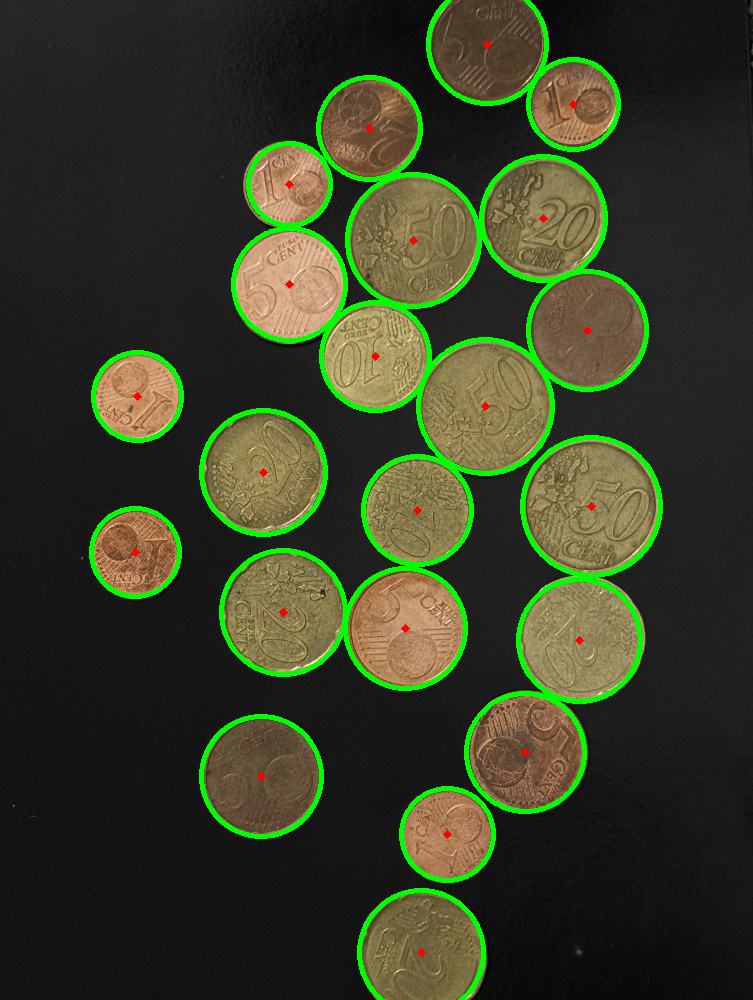

# Presentation
Ce projet vise à développer un système de comptage de pièces présentent dans des images en utilisant deux approches principales : une basée sur la détection de contours et une autre basée sur la transformation de Hough pour détecter des cercles.

La dataset fournie pour ce projet présente une grande variance en termes de positionnement des pièces, d'éclairage et de texture de l'arrière-plan. Cela constitue un défi intéressant qui nous pousse à appliquer des étapes de prétraitement et à explorer plusieurs approches.

# Dataset

Les images sont variées pour refléter des conditions réalistes, certaines contenant une seule pièce tandis que d'autres en contiennent plusieurs, parfois chevauchées ou très proches. Les variations d'éclairage, y compris l'utilisation de flash, créent des ombres et des reflets indésirables sur les pièces, affectant la qualité des images. De plus, le fond des images peut être non uniforme, simulant des surfaces avec divers motifs ou textures. 

# Approche Proposé

## Approche Contour

Tout d'abord, les images sont réduites d'un facteur de 4 pour simplifier le traitement ultérieur. Ensuite, elles sont converties en niveaux de gris pour faciliter la manipulation. Un flou gaussien est alors appliqué pour réduire le bruit et rendre les contours plus lisses. Pour extraire les bords des objets dans les images, l'algorithme de détection de contours de Canny est utilisé. Ensuite, une opération de dilatation est effectuée pour accentuer les contours. La détection des contours est ensuite réalisée à l'aide de la fonction cv2.findContours, filtrant les contours en fonction de critères tels que leur taille et leur circularité.

## Approche Hough

Dans cette méthode, plusieurs étapes sont suivies pour détecter les cercles dans les images de pièces. Tout d'abord, les images sont redimensionnées d'un facteur de 4 pour réduire leur taille et simplifier le traitement. Ensuite, elles sont converties en niveaux de gris pour une analyse plus efficace. Un flou gaussien est ensuite appliqué pour réduire le bruit dans les images. La transformation de cercle de Hough est alors utilisée pour détecter les cercles dans les images, en spécifiant des critères de distance minimale et maximale ainsi que de rayon minimum et maximum pour la détection des cercles.

## Approche de reconnaissance et calcule de la somme en euro

Notre méthode de détection de pièces dans une image repose sur plusieurs étapes clés. Tout d'abord, les informations essentielles des cercles détectés, telles que leurs rayons et coordonnées, sont extraites et stockées depuis les étapes précédentes. Ensuite, le plus petit rayon parmi tous les cercles détectés est identifié pour servir de référence dans l'évaluation des autres pièces. Par la suite, chaque cercle détecté est analysé individuellement en calculant le ratio de son rayon par rapport au plus petit rayon. Ce ratio est ensuite comparé aux ratios préétablis des différentes pièces avec une tolérance spécifiée. Si le ratio correspond à celui d'une pièce avec une marge d'erreur acceptable, la pièce correspondante est identifiée et sa valeur est ajoutée au total. Cette approche associe donc la détection de cercles effectué précédement avec des comparaisons de ratios pour identifier les pièces dans l'image et évaluer leur valeur respective, fournissant ainsi une estimation du montant total de la monnaie présente.

# Métriques d'Évaluation

## Précision (Accuracy)
La précision est une mesure de la performance du modèle qui évalue le nombre de prédictions correctes par rapport au nombre total d'échantillons. Elle est calculée en divisant le nombre de prédictions correctes par le nombre total d'échantillons. Mathématiquement, la précision se calcule comme suit :  

Précision = (Nombre de prédictions correctes) / (Nombre total d'échantillons) * 100%

## Erreur Absolue Moyenne (Mean Absolute Error - MAE)
L'erreur absolue moyenne est une mesure de la moyenne des erreurs absolues entre les prédictions du modèle et les valeurs réelles. Elle est calculée en prenant la moyenne des valeurs absolues des différences entre les prédictions et les valeurs réelles. Mathématiquement, l'erreur absolue moyenne se calcule comme suit :  

MAE = (1/n) * Σ |y_pred - y_true|

# Résultats Expérimentaux

## Approche Contours
L'approche basée sur la détection de contours a donné les résultats suivants :

-Précision : 31,52%  
-Erreur Absolue Moyenne : 5,03  

## Approche Hough
L'approche basée sur la transformation de Hough a donné les résultats suivants :

-Précision : 78,26%  
-Erreur Absolue Moyenne : 1,67  

Ces résultats mettent en évidence la performance supérieure de l'approche utilisant la transformation de Hough par rapport à celle basée sur la détection de contours. L'approche Hough présente une précision nettement plus élevée et une erreur absolue moyenne plus faible, ce qui indique une meilleure capacité à estimer le nombre de pièces dans les images.

## Amélioration approche Hough

Le principal défi de l'approche Hough précédente était la tendance à générer plusieurs cercles pour une seule pièce dans certaines situations. Dans cette version améliorée, nous avons cherché à résoudre ce problème en introduisant une comparaison entre les cercles détectés, permettant ainsi d'éliminer les cercles qui se chevauchent.

Ce changement à grandement amélioré les performaces, la **précision** est maintenant de **78.26%** et la **MAE est de 1.67**.

## Limitations et pistes d'amélioration : 

- Optimiser l'acquisition de données : Bien que la dataset actuelle offre une variabilité intéressante, il serait bénéfique de capturer des images de pièces dans un environnement plus contrôlé, avec des arrière-plans et un éclairage optimal. Cela simplifierait la tâche de traitement.
- Intégrer le deep learning pour améliorer les performances : L'incorporation de techniques de deep learning, notamment les réseaux de neurones convolutionnels (CNN), pourrait potentiellement accroître la précision du système de détection de pièces.
- Diversifier les techniques de prétraitement d'image : En plus du flou gaussien et de la conversion en niveaux de gris, il serait judicieux d'explorer d'autres méthodes de prétraitement d'image pour améliorer la qualité des données en entrée. Cela pourrait inclure des techniques telles que l'égalisation d'histogramme, la normalisation des couleurs ou l'amélioration du contraste.

# Conclusion

En comparant les deux approches, nous observons que la détection basée sur la transformation de Hough atteint une meilleure précision par rapport à celle basée sur les contours. Malgré que l'approche contour semble mieux reconnaitre les pièces prise sous des angles larges.. Chaque approche a donc ses avantages et ses limitations, et le choix dépend des exigences spécifiques du projet et des caractéristiques des données. Ce projet illustre l'importance de comprendre et d'explorer différentes techniques de détection d'objets pour obtenir les meilleurs résultats possibles.
